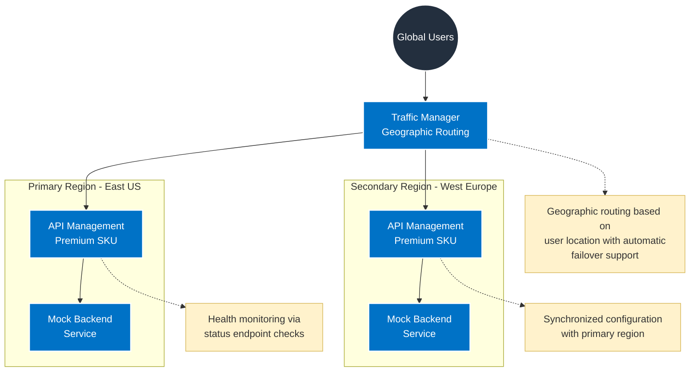

# Multi-Region API Management Architecture

## Key Components

1. **Traffic Manager**
   - Geographic routing method
   - Health monitoring of regional endpoints
   - Automatic failover support

2. **Primary Region (East US)**
   - Premium SKU API Management instance
   - Mock backend service
   - Status endpoint monitoring

3. **Secondary Region (West Europe)**
   - Premium SKU API Management instance
   - Mock backend service
   - Synchronized with primary region

## Traffic Flow
1. Users connect to the nearest API Management instance based on their geographic location
2. Traffic Manager routes requests using geographic routing rules
3. Each regional API Management instance processes requests and forwards them to backend services
4. Health monitoring ensures high availability across regions

## Security Note
- All endpoints use secure HTTPS communication
- Regional status endpoints are monitored by Traffic Manager
- Authentication and authorization handled by API Management
- Configuration synchronized securely between regions
